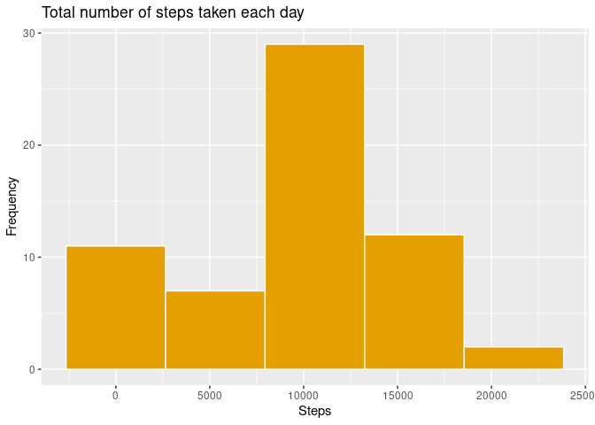
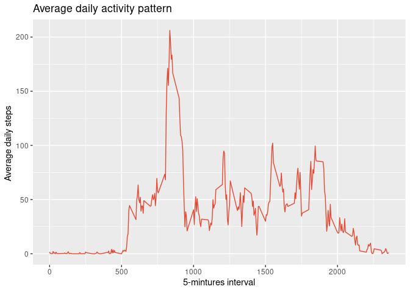
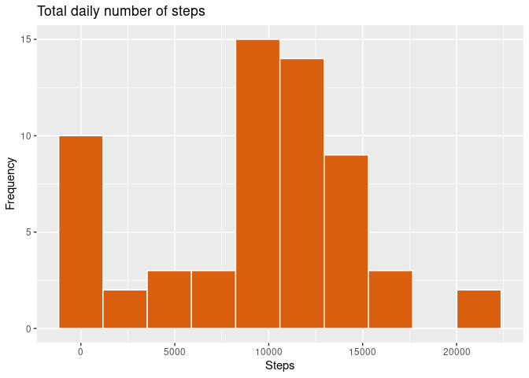
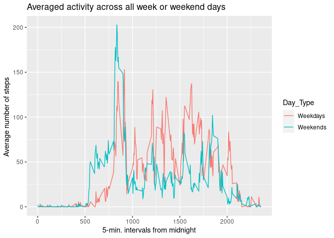

## Loading and preprocessing the data
    1. Load the data (i.e. read.csv())
    2. Process/transform the data (if necessary) into a format 
    suitable for your analysis
    

```r
knitr::opts_chunk$set(echo = TRUE)

library(tidyverse)
```

```
## ── Attaching packages ───────────────────────────────────────────────────────────────── tidyverse 1.3.0 ──
```

```
## ✓ ggplot2 3.3.0     ✓ purrr   0.3.4
## ✓ tibble  3.0.1     ✓ dplyr   0.8.5
## ✓ tidyr   1.0.3     ✓ stringr 1.4.0
## ✓ readr   1.3.1     ✓ forcats 0.5.0
```

```
## ── Conflicts ──────────────────────────────────────────────────────────────────── tidyverse_conflicts() ──
## x dplyr::filter() masks stats::filter()
## x dplyr::lag()    masks stats::lag()
```

```r
library(data.table)
```

```
## 
## Attaching package: 'data.table'
```

```
## The following objects are masked from 'package:dplyr':
## 
##     between, first, last
```

```
## The following object is masked from 'package:purrr':
## 
##     transpose
```

```r
download.file("https://d396qusza40orc.cloudfront.net/repdata%2Fdata%2Factivity.zip", 
              "activity.zip")

path <- getwd()

unzip(zipfile = "activity.zip")

data <- read.csv("activity.csv")
str(data)
```

```
## 'data.frame':	17568 obs. of  3 variables:
##  $ steps   : int  NA NA NA NA NA NA NA NA NA NA ...
##  $ date    : Factor w/ 61 levels "2012-10-01","2012-10-02",..: 1 1 1 1 1 1 1 1 1 1 ...
##  $ interval: int  0 5 10 15 20 25 30 35 40 45 ...
```

## What is mean total number of steps taken per day?

    1.  Calculate the total number of steps taken per day.

```r
data$date <- as.Date(data$date)
stepsday <- data %>%
       group_by(date) %>%
        summarise(sumsteps = sum(steps, na.rm = TRUE)) 

#Display first 10 rows of data
head(stepsday, 10)
```

```
## # A tibble: 10 x 2
##    date       sumsteps
##    <date>        <int>
##  1 2012-10-01        0
##  2 2012-10-02      126
##  3 2012-10-03    11352
##  4 2012-10-04    12116
##  5 2012-10-05    13294
##  6 2012-10-06    15420
##  7 2012-10-07    11015
##  8 2012-10-08        0
##  9 2012-10-09    12811
## 10 2012-10-10     9900
```

    2. If you do not understand the difference between a histogram and a barplot,
    research the difference between them. Make a histogram of the total number of
    steps taken each day.
<!-- -->

    3. Calculate and report the mean and median of the total number 
    of steps taken per day.

```r
meansteps <- stepsday %>% 
  summarise(meansteps = mean(sumsteps))
paste("The mean number of daily steps is:",
      meansteps)
```

```
## [1] "The mean number of daily steps is: 9354.22950819672"
```

```r
mediansteps <- stepsday %>% 
  summarise(mediansteps = median(sumsteps)) 
paste("The median number of daily steps is:",
      mediansteps)
```

```
## [1] "The median number of daily steps is: 10395"
```


## What is the average daily activity pattern?
         
    1. Make a time series plot (i.e. type = "l") of the 5-minute interval 
    (x-axis) and the average number of steps taken, averaged across all days (y-axis)
 
<!-- -->

    2. Which 5-minute interval, on average across all the days in the dataset, 
    contains the maximum number of steps?

```r
maxsteps <- avgsteps$interval[which.max(avgsteps$Mean)]
paste("The 5-minute interval that, on average, 
      contains the maximum number of steps is: ", maxsteps)
```

```
## [1] "The 5-minute interval that, on average, \n      contains the maximum number of steps is:  835"
```

## Imputing missing values
Note that there are a number of days/intervals where there are missing values 
(coded as NA). The presence of missing days may introduce bias into some calculations 
or summaries of the data.

    1. Calculate and report the total number of missing values in the
    dataset (i.e. the total number of rows with NAs)

```r
totalNA <- sum(is.na(data$steps))
paste("Total number of  missing values in the dataset: ", totalNA)
```

```
## [1] "Total number of  missing values in the dataset:  2304"
```

    2. Devise a strategy for filling in all of the missing values in the dataset. 
    The strategy does not need to be sophisticated. For example, you could use the
    mean/median for that day, or the mean for that 5-minute interval, etc.

```r
stepsdayNoNA <- data %>%
             replace(is.na(.), 0)
head(stepsdayNoNA)
```

```
##   steps       date interval
## 1     0 2012-10-01        0
## 2     0 2012-10-01        5
## 3     0 2012-10-01       10
## 4     0 2012-10-01       15
## 5     0 2012-10-01       20
## 6     0 2012-10-01       25
```
     
    3. Create a new dataset that is equal to the original dataset but with the missing data filled in.

```r
write_csv(stepsdayNoNA, "stepsdayNoNA.csv")
```


    4. Make a histogram of the total number of steps taken each day and Calculate 
    and report the mean and median total number of steps taken per day. Do these 
    values differ from the estimates from the first part of the assignment? What 
    is the impact of imputing missing data on the estimates of the total daily 
    number of steps?


```
## # A tibble: 10 x 2
##    date       sumsteps
##    <fct>         <int>
##  1 2012-10-01        0
##  2 2012-10-02      126
##  3 2012-10-03    11352
##  4 2012-10-04    12116
##  5 2012-10-05    13294
##  6 2012-10-06    15420
##  7 2012-10-07    11015
##  8 2012-10-08        0
##  9 2012-10-09    12811
## 10 2012-10-10     9900
```

<!-- -->

## Are there differences in activity patterns between weekdays and weekends?

    1. Create a new factor variable in the dataset with two 
    levels – “weekday” and “weekend” indicating whether a given
    date is a weekday or weekend day.
  

```r
meansteps2 <- stepsday2 %>% 
  summarise(meansteps = mean(sumsteps))
paste("The mean number of daily steps is:",
      meansteps2)
```

```
## [1] "The mean number of daily steps is: 9354.22950819672"
```

```r
mediansteps2 <- stepsday2 %>%
  summarise(mediansteps = median(sumsteps)) 
paste("The median number of daily steps is:", 
      mediansteps2)
```

```
## [1] "The median number of daily steps is: 10395"
```

    2. Make a panel plot containing a time series plot (i.e. type = "l") 
    of the 5-minute interval (x-axis) and the average number of steps taken,
    averaged across all weekday days or weekend days (y-axis). See the README 
    file in the GitHub repository to see an example of what this plot should 
    look like using simulated data.

```
## Joining, by = c("steps", "date", "interval", "Day_Type", "meansteps")
```

<!-- -->
